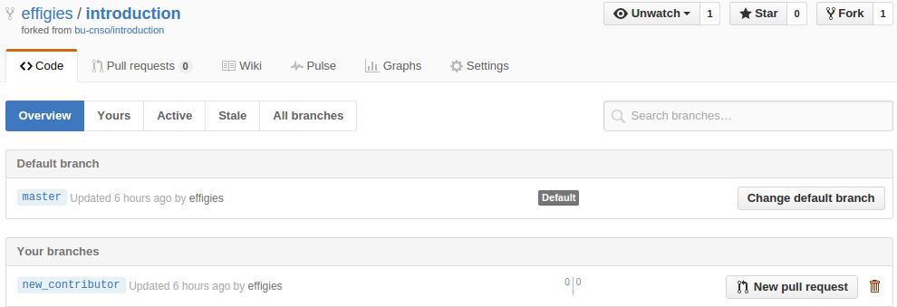

# Introduction

This repository exists to get people used to git commands and the Github
interface.

## Prerequisites

The following steps are required of anybody participating in this introduction.

1. [Sign up for a Github account](https://github.com/join)
2. Request to join the [bu-cnso](https://github.com/bu-cnso) group by
   emailing me. (Or the list, if you don't know my email.)
3. [Install](https://help.github.com/articles/set-up-git/) git on your laptop
  1. You can also use git installation on a server you can SSH into.
  2. The [Github client](https://desktop.github.com/) doesn't
     count.
    1. Except that's the way Github recommends you to install git on Windows.
       We won't be discussing the graphical client, so make sure you can do
       step 5 from the command-line.
4. [Add a public key](https://help.github.com/categories/ssh/) to your Github
   account. The private key should be on the computer you plan to use.
5. Create an initial repository for your user and follow the instructions to
   make an initial commit.

## Lesson plan

Note that lines beginning with `$ ` are shell commands, and the lines following
it are example output. Do not type the `$ ` prompt.

Begin by setting the USER variable to your Github username:

```bash
$ export USER=...
```

Or just note that whenever you see `$USER`, you're supposed to put in your
username.

### Forking a project

When you want to contribute code to a project, you will often begin by forking,
which simply copies the entire repository under your user.


You can then clone your own repository:

    $ git clone git@github.com:$USER/introduction.git
    Cloning into 'introduction'...
    remote: Counting objects: 21, done.
    remote: Compressing objects: 100% (14/14), done.
    remote: Total 21 (delta 3), reused 0 (delta 0), pack-reused 3
    Receiving objects: 100% (21/21), 15.75 KiB | 0 bytes/s, done.
    Resolving deltas: 100% (3/3), done.
    Checking connectivity... done.

Cloning copies the repository, sets the cloning URL as the `origin` remote, and
checks out the `master` branch. We'll become more familiar with remotes and
branches as we continue.

    $ cd introduction
    $ ls -AF
    .git/  images/  README.md
    $ ls -AF .git
    branches/  info/  objects/  config       FETCH_HEAD  index
    hooks/     logs/  refs/     description  HEAD        packed-refs

The state of the repository is kept in `.git`. You'll rarely have cause to
manipulate it directly, but when you run a `git` command, this is where it
does most of its work.

We can see the initial state by running the following:

    $ git remote -v
    origin  git@github.com:$USER/introduction.git (fetch)
    origin  git@github.com:$USER/introduction.git (push)
    $ git status
    On branch master
    Your branch is up-to-date with 'origin/master'.

    nothing to commit, working directory clean
    $ git log --oneline
    7f177b7 Merge pull request #1 from effigies/prerequisites
    5d72ac3 Add Windows caveat
    edfcd33 Miscopied URL
    66ce13d Add prerequisites
    2f44ab8 Start with README

Let's set an upstream remote:

    $ remote add upstream git@github.com:bu-cnso/introduction.git
    $ git remote -v
    origin  git@github.com:$USER/introduction.git (fetch)
    origin  git@github.com:$USER/introduction.git (push)
    upstream    git@github.com:bu-cnso/introduction.git (fetch)
    upstream    git@github.com:bu-cnso/introduction.git (push)
    $ git fetch upstream
    From github.com:bu-cnso/introduction
     * [new branch]      master     -> upstream/master

### Starting a branch

Unless you're *really* forking (i.e. intend to maintain your own copy of the
project), what you often want to do is make a change and get it accepted into
the main repository.

If it's been a while since you forked, `upstream` may have been updated. As a
rule, start new branches off of `upstream/master`, not *your* repository.

    $ git fetch upstream
    $ git checkout upstream/master
    HEAD is now at 7f177b7... Merge pull request #1 from effigies/prerequisites
    $ git status
    HEAD detached at upstream/master
    nothing to commit, working directory clean

Create a branch by checking it out:

    $ git checkout -b new_contributor
    Switched to a new branch 'new_contributor'

Any changes you commit will now be tracked by this branch. Set this branch to
"track" the remote `origin` (YOUR repository).

    $ git push -u origin new_contributor
    Total 0 (delta 0), reused 0 (delta 0)
    To git@github.com:$USER/introduction.git
     * [new branch]      new_contributor -> new_contributor
    Branch new_contributor set up to track remote branch new_contributor from origin.

We see a [new branch](../../branches) in Github.



# About README.md

This file is written in
[Markdown](https://help.github.com/categories/writing-on-github/), a simple
markup language.
