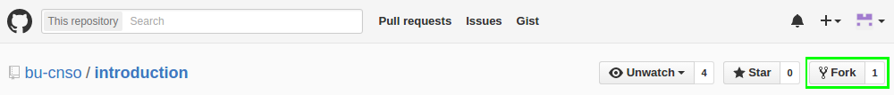

# The Github Model

Github encourages a particular perspective of how to work in git, which centers
around the pull request.

## Forking a project

When you want to contribute code to a project, you will often begin by forking,
which simply copies the entire repository under your user.



You can then clone your own repository:

```ShellSession
$ git clone git@github.com:$USER/introduction.git
Cloning into 'introduction'...
remote: Counting objects: 21, done.
remote: Compressing objects: 100% (14/14), done.
remote: Total 21 (delta 3), reused 0 (delta 0), pack-reused 3
Receiving objects: 100% (21/21), 15.75 KiB | 0 bytes/s, done.
Resolving deltas: 100% (3/3), done.
Checking connectivity... done.
```

Cloning copies the repository, sets the cloning URL as the `origin` remote, and
checks out the `master` branch. We'll become more familiar with remotes and
branches as we continue, but basically a remote is another copy of the same
respository, and a branch is a particular history (series of commits) of the
repository.

```ShellSession
$ cd introduction
$ ls -AF
.git/  images/  README.md
$ ls -AF .git
branches/  info/  objects/  config       FETCH_HEAD  index
hooks/     logs/  refs/     description  HEAD        packed-refs
```

The state of the repository is kept in `.git`. You'll rarely have cause to
manipulate it directly, but when you run a `git` command, this is where it
does most of its work.

We can see the initial state by running the following:

```ShellSession
$ git remote -v
origin  git@github.com:$USER/introduction.git (fetch)
origin  git@github.com:$USER/introduction.git (push)
$ git status
On branch master
Your branch is up-to-date with 'origin/master'.

nothing to commit, working directory clean
$ git log --oneline
7f177b7 Merge pull request #1 from effigies/prerequisites
5d72ac3 Add Windows caveat
edfcd33 Miscopied URL
66ce13d Add prerequisites
2f44ab8 Start with README
```

Let's set an upstream remote:

```ShellSession
$ git remote add upstream git@github.com:bu-cnso/introduction.git
$ git remote -v
origin  git@github.com:$USER/introduction.git (fetch)
origin  git@github.com:$USER/introduction.git (push)
upstream    git@github.com:bu-cnso/introduction.git (fetch)
upstream    git@github.com:bu-cnso/introduction.git (push)
$ git fetch upstream
From github.com:bu-cnso/introduction
 * [new branch]      master     -> upstream/master
```

#### Summary of commands

* `git clone` - Copy repository
* `git remote -v` - View remotes (verbose mode)
* `git log --oneline` - Print log of commits (in short format)
* `git remote add` - Add a new remote
* `git fetch` - Retrieve branches from remote
* `git status` - View current repositorys status

## Starting a branch

Unless you're *really* forking (i.e. intend to maintain your own copy of the
project), what you often want to do is make a change and get it accepted into
the main repository.

If it's been a while since you forked, `upstream` may have been updated. As a
rule, start new branches off of `upstream/master`, not *your* repository.

```ShellSession
$ git fetch upstream
$ git checkout upstream/master
HEAD is now at 7f177b7... Merge pull request #1 from effigies/prerequisites
$ git status
HEAD detached at upstream/master
nothing to commit, working directory clean
```

Create a branch by checking it out:

```ShellSession
$ git checkout -b new_contributor
Switched to a new branch 'new_contributor'
```

Any changes you commit will now be tracked by this branch. Set this branch to
"track" the remote `origin` (*your* repository on Github).

```ShellSession
$ git push -u origin new_contributor
Total 0 (delta 0), reused 0 (delta 0)
To git@github.com:$USER/introduction.git
 * [new branch]      new_contributor -> new_contributor
Branch new_contributor set up to track remote branch new_contributor from origin.
```

We see a [new branch](../../branches) in Github.


Add ourselves to the `PARTICIPANTS` file:

```ShellSession
$ echo $USER >> PARTICIPANTS
$ git status
On branch new_contributor
Your branch is up-to-date with 'origin/new_contributor'.

Changes not staged for commit:
  (use "git add <file>..." to update what will be committed)
  (use "git checkout -- <file>..." to discard changes in working directory)

        modified:   PARTICIPANTS

no changes added to commit (use "git add" and/or "git commit -a")
```

*Stage* the new change:

```ShellSession
$ git add PARTICIPANTS
$ git status
On branch new_contributor
Your branch is up-to-date with 'origin/new_contributor'.

Changes to be committed:
  (use "git reset HEAD <file>..." to unstage)

        modified:   PARTICIPANTS
```

*Commit* the change and *push* (to `origin`, which we've set as the default):

```ShellSession
$ git commit -m "New contributor: $USER"
$ git push
Counting objects: 5, done.
Delta compression using up to 4 threads.
Compressing objects: 100% (2/2), done.
Writing objects: 100% (3/3), 309 bytes | 0 bytes/s, done.
Total 3 (delta 0), reused 0 (delta 0)
To git@github.com:$USER/introduction.git
   7f177b7..d89a96d  new_contributor -> new_contributor
```

#### Summary of commands

* `git fetch` - Retrieve recent branches from remote
* `git checkout` - Set repository to a known state (commit)
* `git checkout -b` - Create a new branch at current commit
* `git push -u <REMOTE> <BRANCH>` - Set the current branch to track `<BRANCH>`
    on `<REMOTE>` (creates remote branch, if necessary)
* `git add` - Stage (prepare to commit) a file
* `git commit -m <MESSAGE>` - Commit files with a *commit message*
* `git push` - Send the current branch to its tracking branch

## Making a pull request (PR)

A pull request alerts the upstream repository owner that you're ready to
contribute.


This starts a discussion thread. Often this will become a review process as
they make sure your changes fit in with their philosophy and meet their
standards. It ends when they accept and merge the pull request, reject and
close the pull request, or both of you decide to stop participating in the
conversation and it languishes.

This is where coding turns into a process of persuasion, negotiation, and
managing the emotions of strangers on the Internet.

And this approach of forking feature branches and using non-fast-forward
merges creates a legible history of branching and merging.


There are other ways to manage a project, even on Github. But this is a
model that Github is well-suited for.

## Summary of `git` commands introduced

* [`git clone`](https://git-scm.com/docs/git-clone) - Download and set up an
    entire repository
* [`git remote`](https://git-scm.com/docs/git-remote) - View/manage remote
    repositories
* [`git status`](https://git-scm.com/docs/git-status) - View branch information
    and status of files in repository
* [`git log`](https://git-scm.com/docs/git-log) - View commit history of
    current repository state
* [`git fetch`](https://git-scm.com/docs/git-fetch) - Retrieve commits from
    remotes
* [`git checkout`](https://git-scm.com/docs/git-checkout) - Set repository
    state to a known commit
  * `git checkout -b` - Create a new branch at current commit
* [`git add`](https://git-scm.com/docs/git-add) - Stage a change (prepare to
    commit)
* [`git commit`](https://git-scm.com/docs/git-commit) - Create a history node
* [`git push`](https://git-scm.com/docs/git-push) - Copy commit history from
    current branch to remote
  * `git push -u` - Set branch on remote current branch should track

You can play with a number of these commands to get a sense of what they're
doing behind the scenes here: [Visualizing Git Concepts with
D3](https://onlywei.github.io/explain-git-with-d3/)
