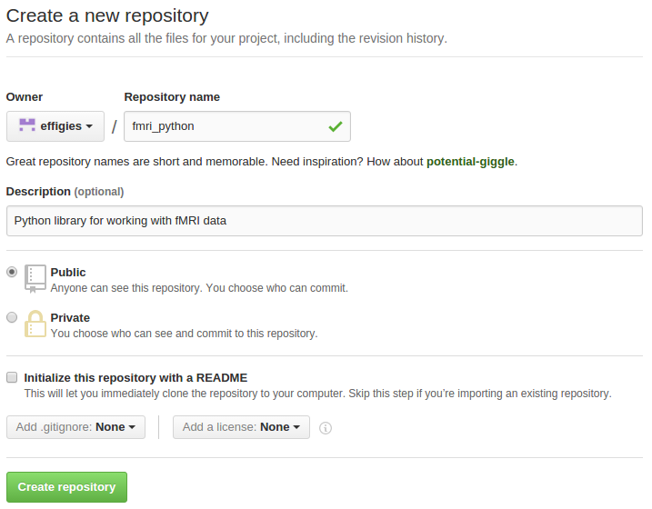

# Personal Projects

Let's suppose that you're working on code for your lab, and your primary goals
are to track changes and be able to work on multiple computers without too much
pain.

Github is merely auxilliary to this mode of working, providing a nice interface
for looking at your repository history. You could just as well use
[gitolite](http://gitolite.com/gitolite/) or
[Gitlab](https://about.gitlab.com/), if you're comfortable or want to become
comfortable with some system administration.

## Simulation

Fork [fmri_python](https://github.com/bu-cnso/fmri_python/). This is a
repository where I simulate the process of managing a repository on different
machines, represented by different branches.

I will walk you through how we set things up, but the **Simulation setup**
subheadings will be actual instructions you need to participate.

### Starting a repository

Let's assume we've been working for a while, and want to start managing our
project with git.

```ShellSession
$ ls
freesurfer.py  images.py  params.py  util.py
```

Begin with:

```ShellSession
$ git init
Initialized empty Git repository in /data/$USER/Projects/fmri_python/.git/
$ git add params.py util.py
$ git commit -m 'Add environment and generic utility functions'
[master (root-commit) d9b8520] Add environment and generic utility functions
 2 file changed, 69 insertions(+), 0 deletions(-)
 create mode 100644 params.py
 create mode 100644 util.py
$ git add images.py
$ git commit -m 'Basic operations on image files'
[master  34591e4] Basic operations on image files
 1 file changed, 80 insertions(+), 0 deletions(-)
 create mode 100644 images.py
$ git add freesurfer.py
$ git commit -m 'Functions to work with FreeSurfer datasets'
[master  cf6bc4b] Functions to work with FreeSurfer datasets
 1 file changed, 131 insertions(+), 0 deletions(-)
 create mode 100644 freesurfer.py
```

### Using GitHub as a remote

Create a GitHub repository:


Like so...



And push our repository:

```ShellSession
$ git remote add origin git@github.com:$USER/fmri_python.git
$ git push -u origin master
Counting objects: 13, done.
Delta compression using up to 4 threads.
Compressing objects: 100% (10/10), done.
Writing objects: 100% (13/13), 4.19 KiB | 0 bytes/s, done.
Total 13 (delta 3), reused 13 (delta 3)
To git@github.com:effigies/sandbox.git
 + 76ecddb...645e0c4 master -> master
 Branch master set up to track remote branch master from origin.
```

##### Simulation setup

To get to this point, simply clone the repository onto your computer.

```ShellSession
$ git clone git@github.com:$USER/fmri_python.git
$ cd fmri_python
```

Your GitHub fork is automatically set up as a remote, so you're all set.

### Working from other machines

Cloning the repository onto a laptop, so we can work from home:

```ShellSession
$ git clone git@github.com:$USER/fmri_python.git
Cloning into 'fmri_python'...
remote: Counting objects: 22, done.
remote: Compressing objects: 100% (14/14), done.
remote: Total 22 (delta 9), reused 21 (delta 8), pack-reused 0
Receiving objects: 100% (22/22), 5.72 KiB | 0 bytes/s, done.
Resolving deltas: 100% (9/9), done.
Checking connectivity... done.
```

Remember that this automatically sets up the cloned URL as `origin`, so we
don't need to `git remote add origin ...`.

We don't have [mne](https://github.com/mne-tools/mne-python) installed on our
laptop, so we make a couple quick changes so we can use the other functions in
`images.py`, and commit those.

```ShellSession
$ git diff
```
```Diff
t a/images.py b/images.py
index 84d5c68..a0736cc 100644
--- a/images.py
+++ b/images.py
@@ -7,7 +7,6 @@ import numpy as np
 import scipy as sp
 import scipy.stats
 import nibabel as nib
-import mne


 def mean_images(overlays):
@@ -30,6 +29,7 @@ def t_test_normalized_images(overlays):

 def t_test_images(images, popmean=0.0):
     """Perform per-entry t-test on nibabel spatial images"""
+    import mne
     stack = nib.concat_images(images, check_affines=False)

     tstats, pvalues = sp.stats.ttest_1samp(stack.get_data(), popmean, axis=3)
@@ -41,6 +41,7 @@ def t_test_images(images, popmean=0.0):

 def t_test_2sample(sample_a, sample_b, equal_var=True):
     """t-statistics are positive if a > b"""
+    import mne
     a_stack = nib.concat_images(sample_a, check_affines=False)
     b_stack = nib.concat_images(sample_b, check_affines=False)
```

```ShellSession
$ git add images.py
$ git commit -m 'Import mne when needed'
[master  e791227] Import mne when needed
 1 file changed, 2 insertions(+), 1 deletions(-)
```

##### Simulation setup

First checkout the `laptop/master` branch:

```ShellSession
$ git checkout -t origin/laptop/master
Branch laptop/master set up to track remote branch laptop/master from origin.
Switched to a new branch 'laptop/master'
```

Then set `laptop/master` to track `origin/master`:

```ShellSession
$ git branch --set-upstream-to origin/master
Branch laptop/master set up to track remote branch master from origin.
```

### Setting up a variant repository
We're going to want these files available on the
[SCC](https://www.bu.edu/tech/support/research/computing-resources/scc/):

```ShellSession
$ ssh scc1.bu.edu
$USER@scc1.bu.edu's password: 
$ git clone git@github.com:$USER/fmri_python.git
Cloning into 'fmri_python'...
remote: Counting objects: 22, done.
remote: Compressing objects: 100% (14/14), done.
remote: Total 22 (delta 9), reused 21 (delta 8), pack-reused 0
Receiving objects: 100% (22/22), 5.72 KiB | 0 bytes/s, done.
Resolving deltas: 100% (9/9), done.
Checking connectivity... done.
```

There are some things unique to the SCC, so we set up a branch to manage our
cluster-specific changes.

```ShellSession
$ git checkout -b cluster
Switched to a new branch 'cluster'
```

Changes such as a `qsub` submitter for Python scripts:

```ShellSession
$ git add submitter.sh
$ git commit -m 'Add python script submitter'
[cluster  b80579a] Add python script submitter
 1 file changed, 71 insertions(+), 0 deletions(-)
 create mode 100644 submitter.sh
```

##### Simulation setup

Check out the cluster branch:

```ShellSession
$ git checkout -t origin/cluster
Branch cluster set up to track remote branch cluster from origin.
Switched to a new branch 'cluster'
```

### Conflicting merge

Now suppose we're back on our lab computer, and thought of a different way to
solve the `mne` problem:

```ShellSession
$ git diff
```
```Diff
diff --git a/images.py b/images.py
index 84d5c68..7aeeda0 100644
--- a/images.py
+++ b/images.py
@@ -7,7 +7,10 @@ import numpy as np
 import scipy as sp
 import scipy.stats
 import nibabel as nib
-import mne
+try:
+    import mne
+except ImportError:
+    pass


 def mean_images(overlays):
```

```ShellSession
$ git add images.py
$ git commit -m 'Don't worry if we don't have mne'
[master  645e0c4] Don't worry if we don't have mne
 1 file changed, 4 insertions(+), 1 deletions(-)
```

And we like this change, so push it to GitHub:

```ShellSession
$ git push
```

##### Simulation setup

No setup needed. You're caught up, now. Follow along from here on out.

## Conflict Resolution

Next time we want to work from our laptop...
```ShellSession
$ git checkout laptop/master
```

...we try to push our changes, but get:

```ShellSession
$ git push origin laptop/master:master
To git@github.com:$USER/fmri_python.git
 ! [rejected]        laptop/master -> master (non-fast-forward)
 error: failed to push some refs to 'git@github.com:$USER/fmri_python.git'
 hint: Updates were rejected because a pushed branch tip is behind its remote
 hint: counterpart. Check out this branch and integrate the remote changes
 hint: (e.g. 'git pull ...') before pushing again.
 hint: See the 'Note about fast-forwards' in 'git push --help' for details.
```

*Note that this `git push` command is a little more complicated than usual.
Because `laptop/master` != `master`, we have to specify the remote name, local
branch, and remote branch.*

It asks us to pull first, so we pull:

```ShellSession
$ git pull
Auto-merging images.py
CONFLICT (content): Merge conflict in images.py
Automatic merge failed; fix conflicts and then commit the result.
$ git status
On branch throwaway
Your branch and 'origin/master' have diverged,
and have 1 and 1 different commit each, respectively.
  (use "git pull" to merge the remote branch into yours)

You have unmerged paths.
  (fix conflicts and run "git commit")

Unmerged paths:
  (use "git add <file>..." to mark resolution)

        both modified:      images.py

no changes added to commit (use "git add" and/or "git commit -a")
```

So now we have to look at the file:

```Python
...
import nibabel as nib
<<<<<<< HEAD
=======
try:
    import mne
except ImportError:
    pass
>>>>>>> 645e0c40478cbdb9f6687d6bdc53417c21e3f24d

...
```

`HEAD` indicates your local changes. The SHA1 hash indicates the commit we're
merging in.

## Aside: Dealing with `v1 ... vN` files

A pretty common precursor to version control is to simply copy working versions
of scripts before making any changes, and your directory can start to fill up
with files labeled with the date, or simply a sequential version number.

Let's suppose we have `script.m` already in the repository, and two old
versions hanging around:

```ShellSession
$ ls
script.m  script_v1.m  script_v2.m
$ git status
On branch master
Untracked files:
  (use "git add <file>..." to include in what will be committed)

        script_v1.m
        script_v2.m

nothing added to commit but untracked files present (use "git add" to track)
```

Create a new branch called `old_versions`, add the old versions to it, and
return to `master`.

```ShellSession
$ git checkout -b old_versions
Switched to a new branch 'old_versions'
$ git add script_v1.m script_v2.m
$ git commit -m 'Track old versions'
[old_versions 8315c28] Track old versions
 2 file changed, 67 insertions(+), 0 deletions(-)
 create mode 100644 script_v1.m
 create mode 100644 script_v2.m
$ git push -u origin old_versions
Counting objects: 3, done.
Delta compression using up to 4 threads.
Compressing objects: 100% (2/2), done.
Writing objects: 100% (2/2), 264 bytes | 0 bytes/s, done.
Total 2 (delta 0), reused 0 (delta 0)
To git@github.com:$USER/matlab_project.git
 * [new branch]      old_versions -> old_versions
 Branch old_versions set up to track remote branch old_versions from origin.
$ git checkout master
Switched to branch 'master'
```

You'll see the old versions are gone, but we can bring them back as needed:

```ShellSession
$ ls
script.m
$ git checkout old_versions
Switched to branch 'old_versions'
$ ls
script.m  script_v1.m  script_v2.m
```

Alternately, you can bring back an old version into the current space:

```ShellSession
$ git checkout master
Switched to branch 'master'
$ ls
script.m
$ git checkout old_versions script_v2.m
$ ls
script.m  script_v2.m
$ git status
On branch master
Your branch is up-to-date with 'origin/master'.

Changes to be committed:
  (use "git reset HEAD <file>..." to unstage)

    new file:   script_v2.m
```
